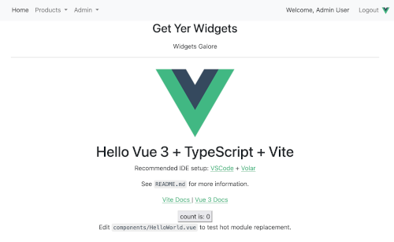

# Project for Golang Intermediate Course

This repo contains my work on the main project of Trevor Sawler's Udemy course, [Building Web Applications with Go - Intermediate Level](https://www.udemy.com/course/building-web-applications-with-go-intermediate-level/learn/lecture/27168806#overview). The original course concentrates on using Go for an ecommerce application, and I recommend it.

I'm posting this archive, however, because I've used the project course to investigate replacing its javascript with progressive enhancement using Vue 3. There's nothing wrong with Trevor's javascript in the course, to be clear. He teaches how to code using plain javascript, sticking close to the standard APIs that all modern browsers implement. This is something any developer should know, or learn. 

But frameworks like Vue, React or Angular are great if a project starts getting large, since you can do elaborate things with the DOM in a very clear way. This is hard to do with the standard javascript APIs, since they take a lot more space to do things that are simple with the dynamic templates of these other libraries.

To get this to work, I've developed a Go module that embeds a Vue build and integrates it with a Go web server. [It's up on Github](https://github.com/torenware/vite-go). If you're interested in the mechanics of getting Vue and Go to work together, I have a much simpler demo application in the module's repo.

It's this app, however, where I've pounded on the integration module and strategy, and worked to get bugs out of the framework. On top of the standard parts of the Go-Stripe app as taught in the course, I've enhanced about a third of the UI to use Vue instead of the original Go-based templates and rendering. These are marked with a small icon ( ) to show which system is doing the work on that page.

The app demonstrates:

* a reuseable form library with validation.
* a reuseable table with pagination.

In all, the Vue pieces look a lot like the parts of the app that still use the original Go approaches, which is part of the point.

## Starting Up The System

Mostly this is just the app as built in the Udemy class, but a few things are necessary now that I've integrated Vue 3:

1. I put settings into a `.env.local` file. This created problems using MySQL DSNs, so I build the DSN on the fly. Works fine, less trouble. A sample file is in the repo.
2. `make start` builds the whole app, and embeds a production build of the Vue code. Building is slow, which is entirely on the Vue build process. The go apps run as `-env prodution`.
3. `make start_dev` builds the go apps as usual, but runs them as `-env development`.  It also brings up the Vite dev server, which does hot updates. It is very fast, and a cool way to develop javascript.

